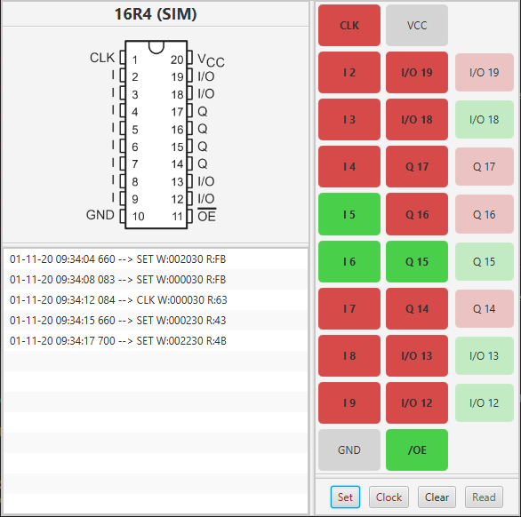

# DuPAL Peeper

## Introduction

The Peeper is a graphical (Written in Java + JavaFX) tool meant to aid in the analisys of *Programmable Array Logic* (PAL) devices: Its main purpose is to show how a device reacts to a change of its inputs.

Is supports two operating modes:

- **Direct** mode: where the tool interfaces with a DuPAL board, toggling the pins of a real PAL device.
- **Simulation** mode: the tool uses a raw state graph dump generated by the *DuPAL Analysis* software to simulate the PAL device and its reactions even if a DuPAL board and the original IC are not available.



## How to use

Currently, the application needs to be launched from the command line. A JRE with Java 1.8 support is required, Java 15 is recommended.

The application can be launched in direct mode by specifying the serial port and PAL modem to use, or in simulation mode by specifying the raw graph dump.

**Direct** mode:

```sh
java -jar peeper.jar --serial=com5 --pal=16L8
```

**Simulation** mode:

```sh
java -jar peeper.jar --dump="E:\test\dump.json"
```

### Interface

The interface is divided into 3 main sections:

- **Top left**: a graphical representation of the pinout of the chip under analysis and its type. A **SIM** tag will appear if simulation mode is being used.
- **Bottom left**: historical log of the pin changes tested on the IC.
- **Right**: a graphical representation of the state of the pins. On the first two columns, the user can set how a pin is driven by the tool, on the rightmost column the actual state as read from the device is shown.

The buttons at the bottom are:

- **Set**: Once a pin changes are selected on the first two columns, set will commit these changes to the devices and actually change how pins are driven (output pins are driven through resistors, to avoid a short circuit and detect Hi-Z pins).
- **Clock**: Same as above, but will also toggle the CLK pin automatically. Will be disabled if the PAL doesn't have a CLK pin.
- **Clear**: If changes to pin state are selected but not committed, this will clear them and restore the previous committed state.
- **Read**: Read the output state again. This is usually not needed as a read is performed automatically after any change to the state, but it can be useful to spot pins that are flipping or with an unstable state.

## Known Issues

- The Simulation mode is still not thoroughly tested and could be bugged.
